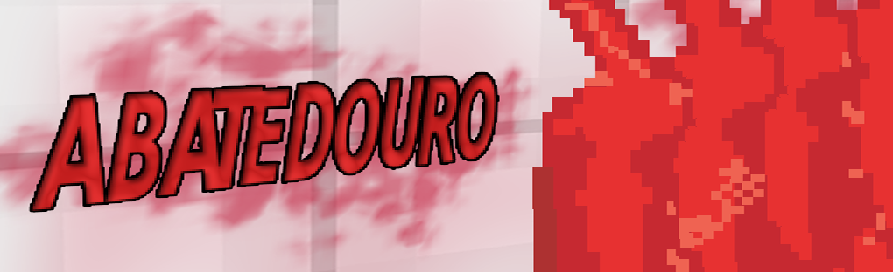
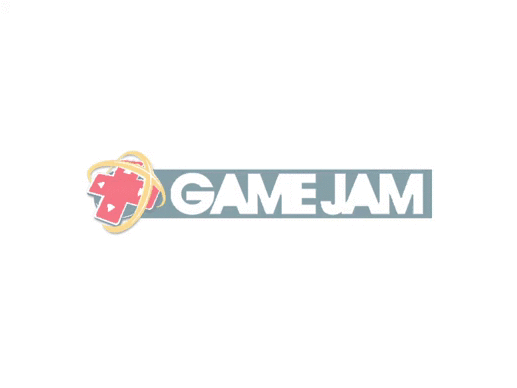
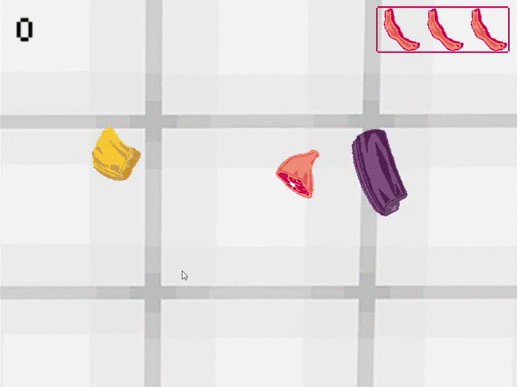

<h1 align="center">
    
</h1>

Game desenvolvido para a Game Jam Construct 2016, com a temática "Bacon"

O Game <b>Abatedouro</b> foi desenvolvido na plataforma Construct 2, para a participação do evento Game Jam Construct no ano de 2016, onde o tema era "Bacon".
Desenvolvi um jogo no estilo do famoso game "Fruit Ninja", onde são lançados itens para o alto aleatoriamente e o seu objetivo e cortá-los o mais rápido possível sem os deixar cair.

Esse é um grande exemplo onde uma ideia simples pode se tornar algo desafiador e proporcionar a utilização de várias técnicas de lógica de programação.

 

 <table style="width:100%" border="0px">
  <tr>
    <td></td>
    <td></td>
  </tr>
</table> 

 
Link para acessaro o jogo: https://www.edsonwander.site/abatedouro/
